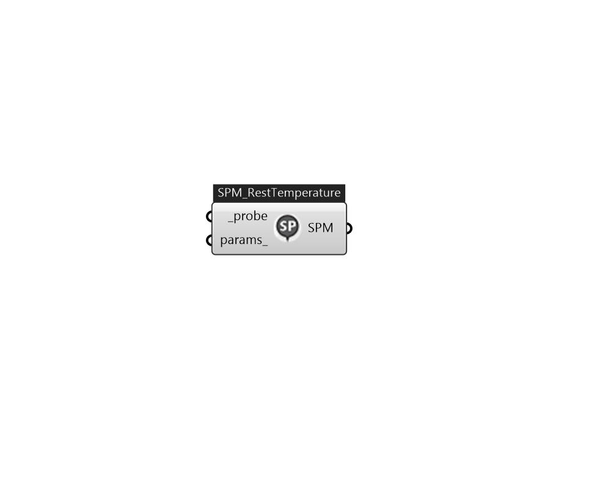

## IB_SetpointManagerSystemNodeResetTemperature

The System Node Reset Setpoint Manager is used to place a temperature setpoint on a system node according to the reference temperature (e.g., return air or outdoor air temperature) of a system node using a linear interpolation between two user-specified reference values and two user-specified setpoint values. In general, the higher the reference temperature, the lower the setpoint. During the simulation, the reference temperature is obtained from the user-specified reference system node. The input consists of the setpoint manager name, the control variable, the name of the node or node list affected by the setpoint, the name of the reference node name, and the data for the reset rule: setpoints at low and high reference temperatures, and low and high reference temperatures.  Above content copyright © 1996-2025 EnergyPlus, all contributors. All rights reserved. EnergyPlus is a trademark of the US Department of Energy. 

#### Inputs
* ##### probe [Required]
Add a IB_NodeProbe to a loop first, and then connect the probe to here for setpoint manager to use. 
* ##### params 
Detail settings for this HVAC object. Use Ironbug_ObjParams to set input parameters, or use Ironbug_OutputParams to set output variables. 

#### Outputs
* ##### SPM
TODO.. 