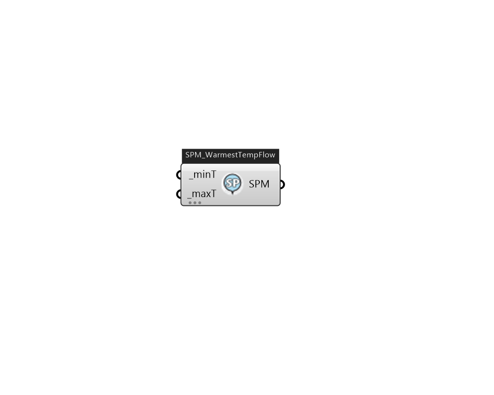

## IB_SetpointManagerWarmestTemperatureFlow

The Warmest Temperature Flow Setpoint Manager resets the cooling supply air temperature of a central forced air HVAC system according to the cooling demand of the warmest zone. The user can select one of two strategies: TemperatureFirst or FlowFirst. For TemperatureFirst the manager tries to find the highest setpoint temperature that will satisfy all the zone cooling loads at minimum supply air flow rate. If this setpoint temperature is less than the minimum, the setpoint temperature is set to the minimum, and the supply air flow rate is increased to meet the loads. For FlowFirst the manager tries to find the lowest supply air flow rate that will satisfy all the zone cooling loads at the maximum setpoint temperature. If this flow is greater than the maximum, the flow is set to the maximum and the setpoint temperature is reduced to satisfy the cooling loads. When compared to a fixed cooling supply air temperature setpoint, the TemperatureFirst strategy minimizes fan energy at the cos.... (Due to the length of content, documentation has been shown partially)  Above content copyright © 1996-2025 EnergyPlus, all contributors. All rights reserved. EnergyPlus is a trademark of the US Department of Energy. 

#### Inputs
* ##### minT [Required]
The minimum allowed setpoint temperature in degrees C. If the calculated setpoint temperature is less than this minimum, the setpoint is set to the minimum.  Unit: C [IP: F]  Above content copyright © 1996-2023 EnergyPlus, all contributors. All rights reserved. EnergyPlus is a trademark of the US Department of Energy. 
* ##### maxT [Required]
The maximum allowed setpoint temperature in degrees C. If the calculated setpoint is greater than this value the setpoint is set to the maximum. This value is also used as the setpoint temperature when none of the zones have a cooling load.  Unit: C [IP: F]  Above content copyright © 1996-2023 EnergyPlus, all contributors. All rights reserved. EnergyPlus is a trademark of the US Department of Energy. 

#### Outputs
* ##### SPM
Setpoint Manager Warmest Temperature Flow 