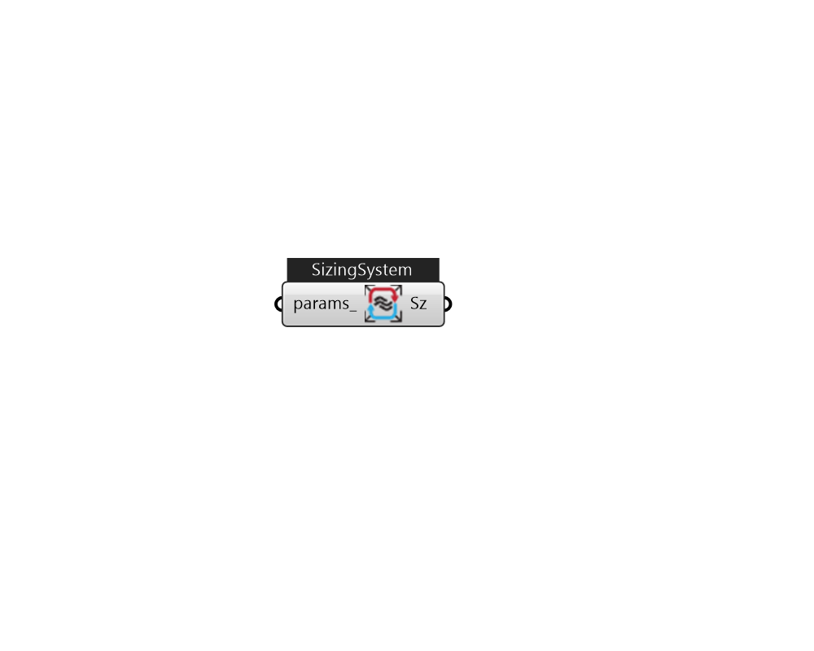

## IB_SizingSystem

The Sizing:System object contains the input needed to perform a central forced air system design air flow, heating capacity, and cooling capacity calculation for a system serving one or more zones. The information needed consists of the outside environmental conditions and the design supply air temperatures, outdoor air flow rate, and minimum system air flow ratio. The outside conditions come from the design days in the input. A system sizing calculation is performed for every design day in the input file and the resulting maximum heating and cooling air flow rates and capacities are saved for use in the component sizing calculations. Supply air conditions are specified by inputting a supply air temperature for cooling, a supply air temperature for heating, and a preheat temperature. The system sizing calculation sums the zone design air flow rates to obtain a system supply air flow rate. The design conditions and the outdoor air flow rate are used to calculate a design mixed air te.... (Due to the length of content, documentation has been shown partially)  Above content copyright © 1996-2025 EnergyPlus, all contributors. All rights reserved. EnergyPlus is a trademark of the US Department of Energy. 

#### Inputs
* ##### params 
Detail settings for this HVAC object. Use Ironbug_ObjParams to set input parameters, or use Ironbug_OutputParams to set output variables. 

#### Outputs
* ##### Sz
SizingSystem 