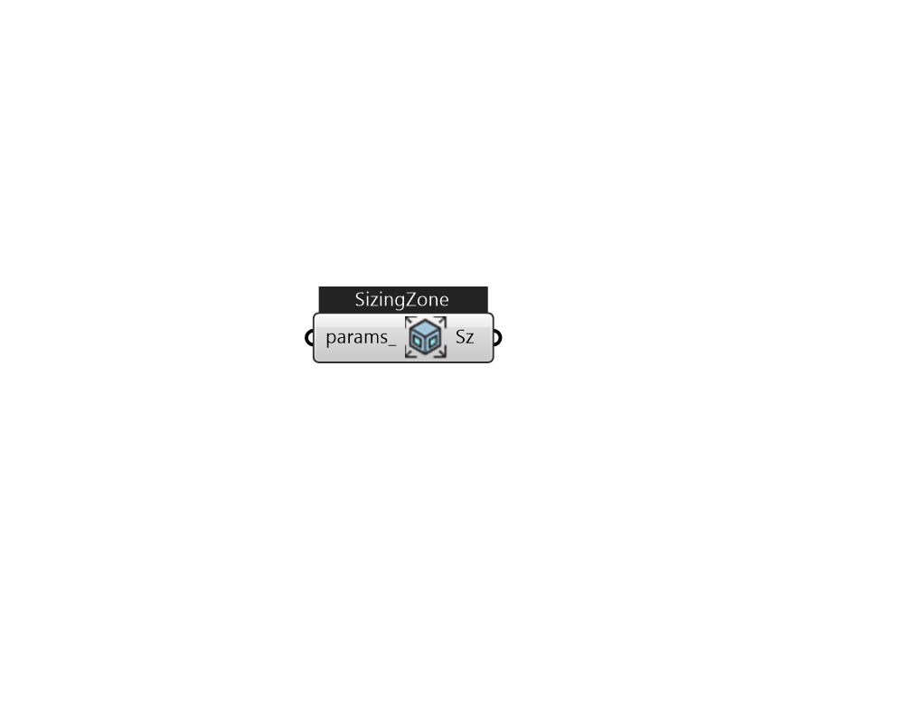

## IB_SizingZone

The Sizing:Zone object provides the data needed to perform a zone design air flow calculation for a single zone. This calculation assumes a variable amount of supply air at a fixed temperature and humidity. The information needed consists of the zone inlet supply air conditions: temperature and humidity ratio for heating and cooling. The calculation is done for every design day included in the input. The maximum cooling load and air flow and the maximum heating load and air flow are then saved for the system level design calculations and for the component automatic sizing calculations. The Sizing:Zone object is also the place where the user can specify the design outdoor air flow rate by referencing the name of a design specification outdoor air object. This can be specified in a number of ways (ref. {DesignSpecification:OutdoorAir}). This data is saved for use in the system sizing calculation or for sizing zone components that use outdoor air. The user can also place limits on the h.... (Due to the length of content, documentation has been shown partially)  Above content copyright © 1996-2025 EnergyPlus, all contributors. All rights reserved. EnergyPlus is a trademark of the US Department of Energy. 

#### Inputs
* ##### params 
Detail settings for this HVAC object. Use Ironbug_ObjParams to set input parameters, or use Ironbug_OutputParams to set output variables. 

#### Outputs
* ##### Sz
SizingZone 