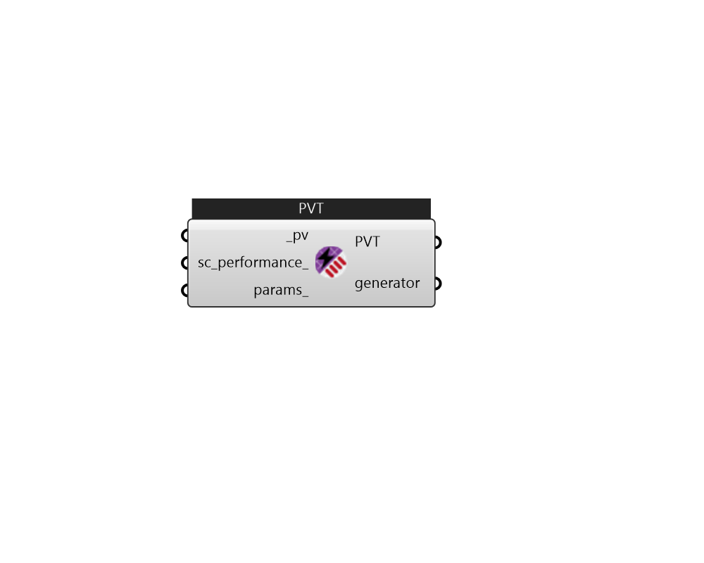

## IB_SolarCollectorFlatPlatePhotovoltaicThermal

This object is used to model hybrid photovoltaic-thermal (PVT) solar collectors that convert incident solar energy into both electricity and useful thermal energy. This object describes the PVT solar collector by referencing other objects that provide more detail or connections to other parts of the EnergyPlus model. The PVT solar collectors need to be connected to either an HVAC air system or a plant loop for collected thermal energy to be utilized. The input field for the type of thermal working fluid informs the program how the PVT collector is expected to be connected. If the the working fluid is air, then the PVT collectors are modeled as a ventilation air pretreatment component and connected to an outdoor air system. If the working fluid is water, then the PVT collectors are modeled as a hot water solar collector and are connected to a plant loop with a water thermal storage tank.  Above content copyright © 1996-2025 EnergyPlus, all contributors. All rights reserved. EnergyPlus is a trademark of the US Department of Energy. 

#### Inputs
* ##### pv [Required]
IB_GeneratorPhotovoltaic 
* ##### sc_performance 
SolarCollectorPerformancePhotovoltaicThermalSimple or SolarCollectorPerformancePhotovoltaicThermalBIPVT 
* ##### params 
Detail settings for this HVAC object. Use Ironbug_ObjParams to set input parameters, or use Ironbug_OutputParams to set output variables. 

#### Outputs
* ##### PVT
Connect the PhotovoltaicThermal (PVT) Solar Collector to the supply side of a hot water or air loop. 
* ##### generator
Connect the PV generator of PVT to ELC Distribution (SubPanel) 