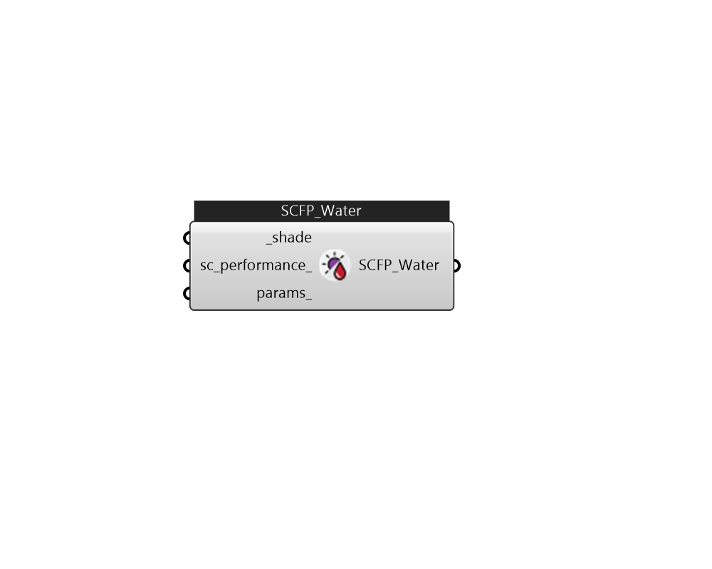

## IB_SolarCollectorFlatPlateWater

The flat-plate solar collector model simulates glazed, unglazed, and tubular (i.e.evacuated tube) collectors. The SolarCollector:FlatPlate:Water object represents a single collector module connected to the plant loop. The thermal and optical properties of the collector module are taken from the referenced {SolarCollectorPerformance:FlatPlate} object. A surface or shading object defines the collector tilt, azimuth, and gross area. The collector surface participates normally in all shading calculations if the ``FullExterior,'' ``FullInteriorAndExterior,'' FullExteriorWithReflections , or FullInteriorAndExteriorWithReflections flags are set in the Solar Distribution field of the Building object. Inlet and outlet nodes are specified for plant connections on the demand side of the plant loop.  Above content copyright © 1996-2025 EnergyPlus, all contributors. All rights reserved. EnergyPlus is a trademark of the US Department of Energy. 

#### Inputs
* ##### shade [Required]
Honeybee Shade 
* ##### sc_performance 
From IB_SolarCollectorPerformanceFlatPlate 
* ##### params 
Detail settings for this HVAC object. Use Ironbug_ObjParams to set input parameters, or use Ironbug_OutputParams to set output variables. 

#### Outputs
* ##### SCFP_Water
Connect to hot water loop's supply side. 