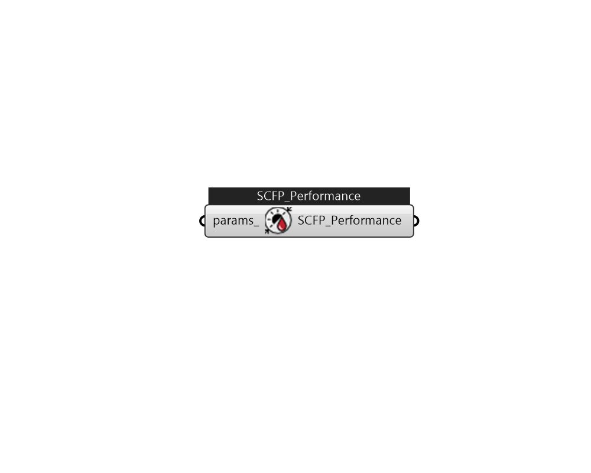

## IB_SolarCollectorPerformanceFlatPlate

The SolarCollectorPerformance:FlatPlate object contains the thermal and optical performance parameters for a single collector module. These parameters are based on the testing methodologies described in ASHRAE Standards 93 and 96. The Solar Rating and Certification Corporation (SRCC) applies these standards in their rating procedures of solar collectors. The ratings for commercially available collectors in North America are published in the {Directory of SRCC Certified Solar Collector Ratings}. The SRCC database has also been converted into an EnergyPlus data set of SolarCollectorPerformance:FlatPlate objects that is included with the program (see SolarCollectors.idf in the DataSets folder). The coefficients for the energy conversion efficiency and incident angle modifier allow first order (linear) or second order (quadratic) correlations. To use a first order correlation, the second order coefficient must be left blank or set to zero. In order for the model to work correctly, the te.... (Due to the length of content, documentation has been shown partially)  Above content copyright © 1996-2025 EnergyPlus, all contributors. All rights reserved. EnergyPlus is a trademark of the US Department of Energy. 

#### Inputs
* ##### params 
Detail settings for this HVAC object. Use Ironbug_ObjParams to set input parameters, or use Ironbug_OutputParams to set output variables. 

#### Outputs
* ##### SCFP_Performance
Connect to IB_SolarCollectorFlatPlateWater 