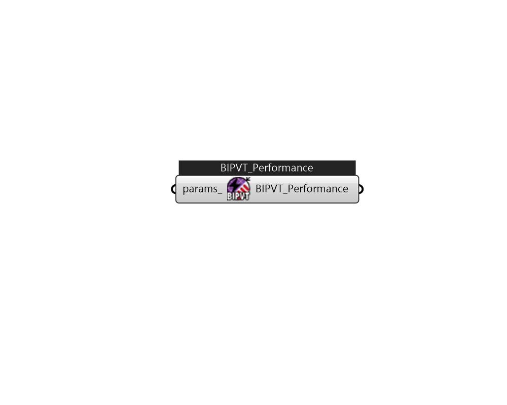

## IB_SolarCollectorPerformancePhotovoltaicThermalBIPVT

This object is used to provide performance details for the Building-Integrated PVT (BIPVT) model. There are no specific output variables for this object, reporting is done by {SolarCollector:FlatPlate:PhotovoltaicThermal}.  Above content copyright © 1996-2025 EnergyPlus, all contributors. All rights reserved. EnergyPlus is a trademark of the US Department of Energy. 

#### Inputs
* ##### params 
Detail settings for this HVAC object. Use Ironbug_ObjParams to set input parameters, or use Ironbug_OutputParams to set output variables. 

#### Outputs
* ##### BIPVT_Performance
Connect to Ironbug_SolarCollectorFlatPlatePhotovoltaicThermal 