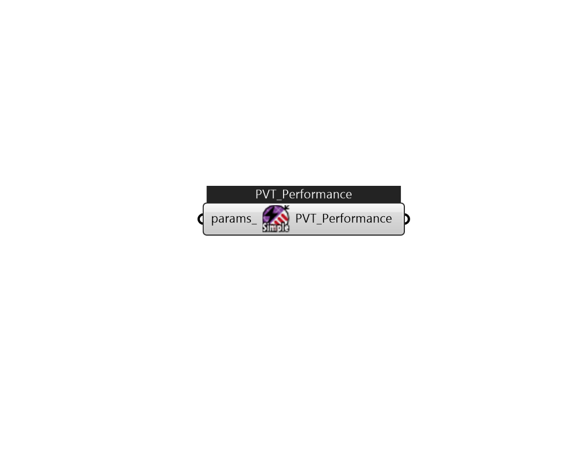

## IB_SolarCollectorPerformancePhotovoltaicThermalSimple

This object is used to provide performance details for the simple PVT model. This is a simple user-defined efficiency model. Thermal conversion efficiency is a constant or scheduled value. There are no output variable for this object, reporting is done by the parent PVT object.  Above content copyright © 1996-2025 EnergyPlus, all contributors. All rights reserved. EnergyPlus is a trademark of the US Department of Energy. 

#### Inputs
* ##### params 
Detail settings for this HVAC object. Use Ironbug_ObjParams to set input parameters, or use Ironbug_OutputParams to set output variables. 

#### Outputs
* ##### PVT_Performance
Connect to Ironbug_SolarCollectorFlatPlatePhotovoltaicThermal 