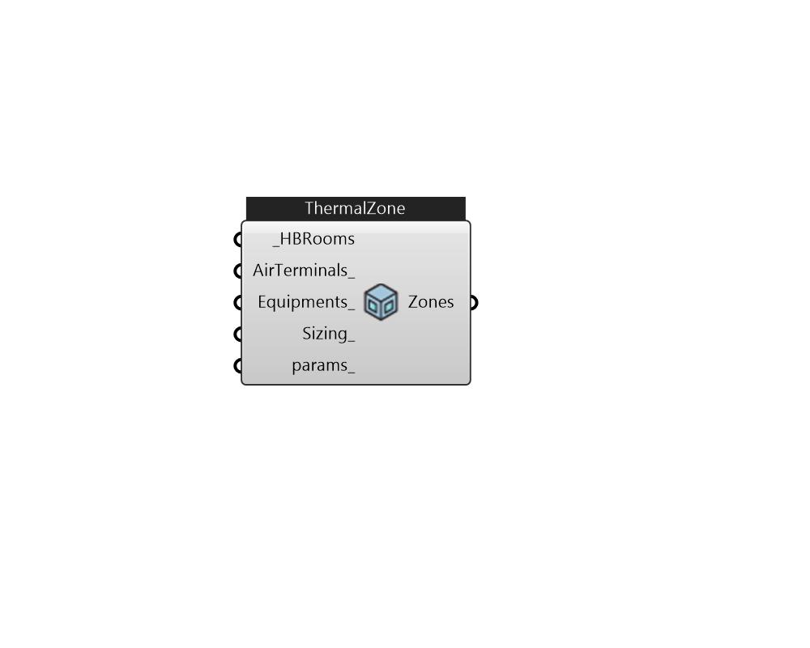

## IB_ThermalZone

Use this component to create thermal zones from Honeybee rooms, OsZones, or zone names 

#### Inputs
* ##### HBRooms [Required]
HBRoom, OsZones, or zone names 
* ##### AirTerminals 
One air terminal per HBRoom, and please provide list of air terminals that matches HBRoom amount;  Default: AirTerminalUncontrolled  
* ##### Equipments 
A ZoneEquipment or ZoneEquipmentGroup per zone.  Use Ironbug_ZoneEquipmentGroup if you have more than one equipments for one zone 
* ##### Sizing 
Zone sizing 
* ##### params 
Detail settings for this HVAC object. Use Ironbug_ObjParams to set input parameters, or use Ironbug_OutputParams to set output variables. 

#### Outputs
* ##### Zones
connect to airloop's demand side 