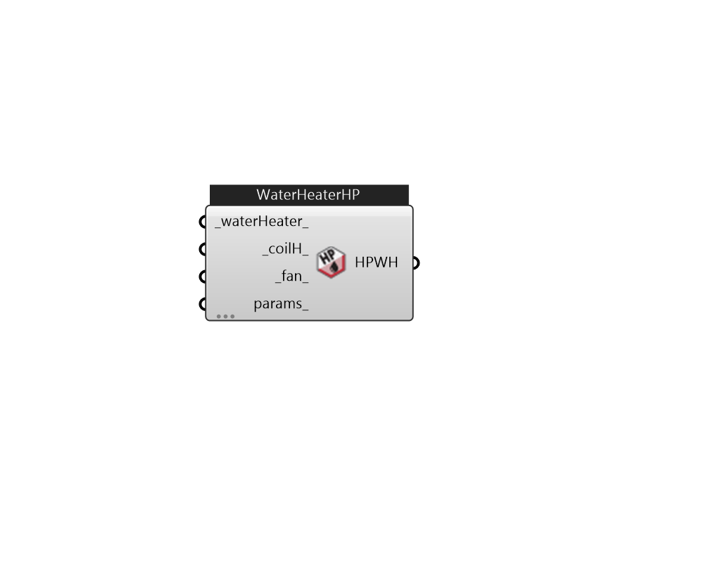

## IB_WaterHeaterHeatPump

There is no component description available now!  Please stay tuned or contribute :>  Source code: https://github.com/MingboPeng/Ironbug 

#### Inputs
* ##### waterHeater 
Water Heater Mixed. Use WaterHeaterMixed 
* ##### coilH 
Heating coil to provide heating source. The only valid choice is CoilWaterHeatingAirToWaterHeatPump 
* ##### fan 
Supply fan. By default, a FanOnOff is included. 
* ##### params 
Detail settings for this HVAC object. Use Ironbug_ObjParams to set input parameters, or use Ironbug_OutputParams to set output variables. 

#### Outputs
* ##### HPWH
Add to room's zone equipment 