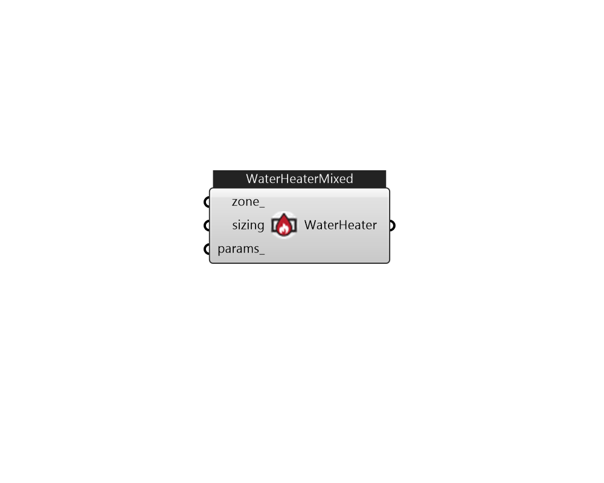

## IB_WaterHeaterMixed

The WaterHeater:Mixed object analytically solves the differential equation governing the energy balance of the water tank. Within a timestep, conditions are solved separately for when the heater element or burner is ``on'' (on-cycle) and when it is ``off'' (off-cycle). This approach allows ambient losses and parasitic loads to be divided into on-cycle and off-cycle effects and accounted for in detail. For losses to the ambient environment, the ambient air temperature can be taken from a schedule, a zone, or the exterior. When used with a zone, a fraction of the skin losses can be added to the zone heat balance as internal heat gains. Control options allow the heater to cycle or modulate to meet the load. When cycling, the heater element or burner is either on or off. The heater remains fully on while heating the tank up to the setpoint temperature. When the setpoint is reached, the heater turns off. The heater remains off until the tank temperature falls below the ``cut-in'' temperat.... (Due to the length of content, documentation has been shown partially)  Above content copyright © 1996-2025 EnergyPlus, all contributors. All rights reserved. EnergyPlus is a trademark of the US Department of Energy. 

#### Inputs
* ##### zone 
AmbientTemperatureThermalZone 
* ##### sizing 
WaterHeaterSizing 
* ##### params 
Detail settings for this HVAC object. Use Ironbug_ObjParams to set input parameters, or use Ironbug_OutputParams to set output variables. 

#### Outputs
* ##### WaterHeater
Connect to hot water loop's supply side. 