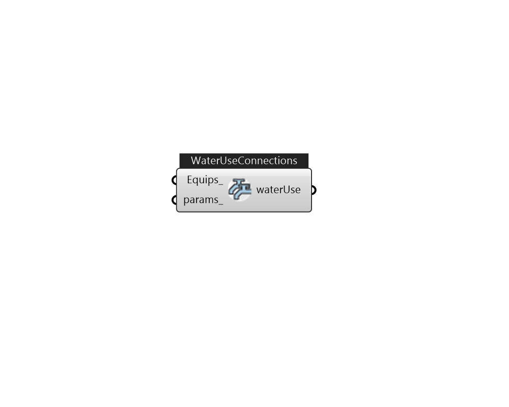

## IB_WaterUseConnections

The WaterUse:Connections object can be thought of as a subsystem that groups together multiple {WaterUse:Equipment} components. As its name suggests, the object provides connections that are shared by these components, including: Inlet node and outlet node connections to a plant loop Connections to {WaterUse:Storage} objects to store and draw reclaimed water Internal connections to simulate drainwater heat recovery. The WaterUse:Connections object can be used stand-alone or coupled into a plant loop. In stand-alone mode, the Hot and Cold Water Supply Temperature Schedules override the values for the listed {WaterUse:Equipment} objects. When coupled to the plant, the Hot Water Supply Temperature Schedule is overridden by the actual plant loop inlet water temperature. When coupled to the plant, the WaterUse:Connections object should be on a Branch object whose control type is set to Active.  Above content copyright © 1996-2025 EnergyPlus, all contributors. All rights reserved. EnergyPlus is a trademark of the US Department of Energy. 

#### Inputs
* ##### Equips 
A list of WaterUseEquipments. 
* ##### params 
Detail settings for this HVAC object. Use Ironbug_ObjParams to set input parameters, or use Ironbug_OutputParams to set output variables. 

#### Outputs
* ##### waterUse
Connect to demand side of plant loop. 