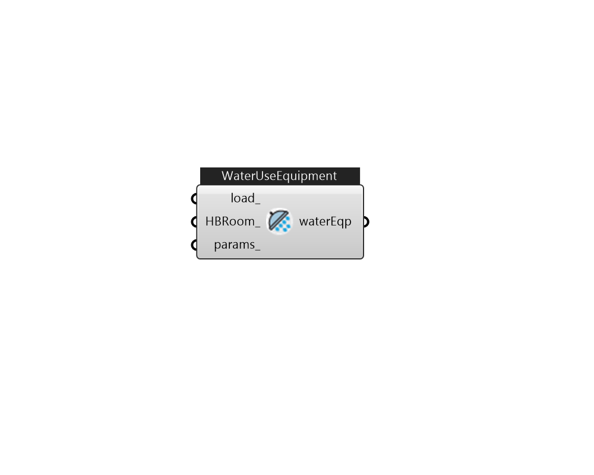

## IB_WaterUseEquipment

The WaterUse:Equipment object is a generalized object for simulating all water end uses. Hot and cold water uses are included, as well as controlled mixing of hot and cold water at the tap. The WaterUse:Equipment object can be used stand-alone, or coupled into a plant loop using the {WaterUse:Connections} object (see below). The {WaterUse:Connections} object allows water uses to be linked to {WaterUse:Storage} objects to store and draw reclaimed water. The {WaterUse:Connections} object can also simulate drainwater heat recovery. The WaterUse:Equipment object serves all of the same purposes as the existing objects: {Exterior:WaterEquipment}, and HotWaterEquipment. The WaterUse:Equipment object does a better job of modeling domestic hot water by allowing mixing at the tap in order to account for both hot {and cold} water used at sinks, showers, etc. It also improves on the stand-alone energy modeling of domestic hot water. Because all of the temperatures and flow rates can be solved, t.... (Due to the length of content, documentation has been shown partially)  Above content copyright © 1996-2025 EnergyPlus, all contributors. All rights reserved. EnergyPlus is a trademark of the US Department of Energy. 

#### Inputs
* ##### load 
Use Ironbug_WaterUseEquipmentDefinition 
* ##### HBRoom 
Honeybee Room 
* ##### params 
Detail settings for this HVAC object. Use Ironbug_ObjParams to set input parameters, or use Ironbug_OutputParams to set output variables. 

#### Outputs
* ##### waterEqp
Connect to Ironbug_WaterUseConnections 