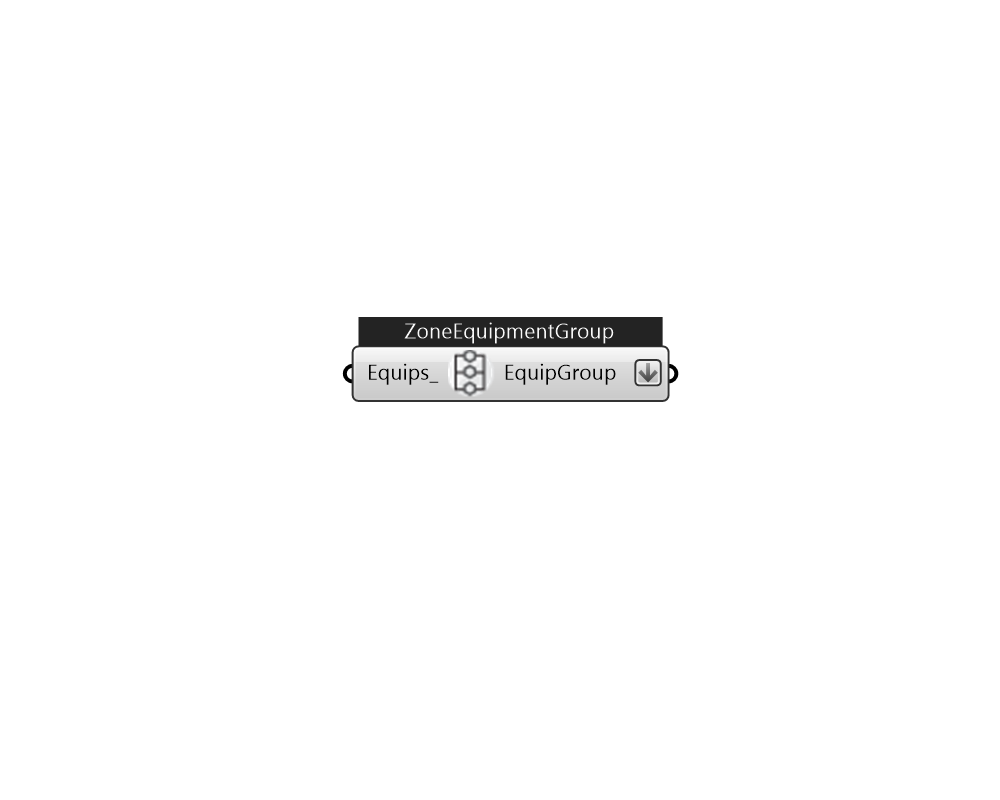

## IB_ZoneEquipmentGroup

Use Ironbug_ZoneEquipmentGroup if you have more than one equipments for one zone 

#### Inputs
* ##### Equips 
A list of zone equipments that will be grouped. 

#### Outputs
* ##### EquipGroup
A list of zone equipment groups that will be added to each zones.Connect to Ironbug_ThermalZone 