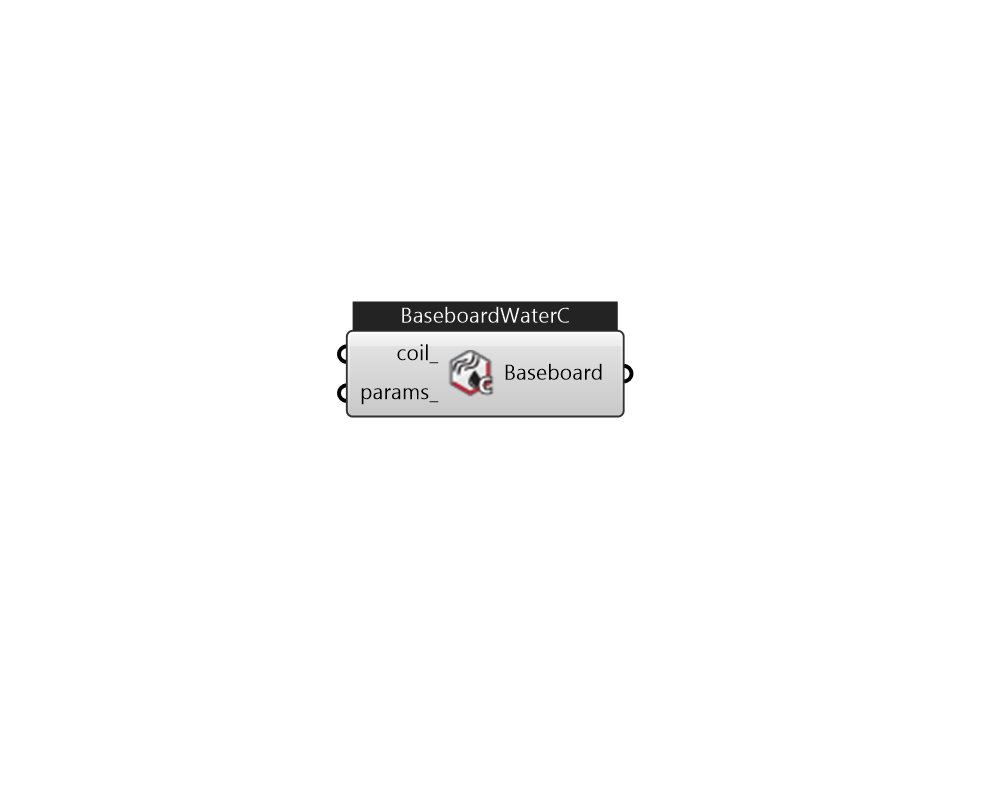

## IB_ZoneHVACBaseboardConvectiveWater

The hot water baseboard heater is a component of zone equipment. The component is controlled to meet any remaining zone load not met by other equipment in the zone that have higher heating priority. The control is accomplished by throttling the hot water flow. Input resembles that for the simple heating coil: there is an availability schedule, an overall UA, and a maximum hot water mass flow rate. The unit is connected to a hot water loop (demand side) with an inlet and outlet node. Finally, there is the convergence tolerance, which is the tolerance on how closely the baseboard outlet will meet the zone load. Of course, this tolerance is relative to the zone load.  Above content copyright © 1996-2025 EnergyPlus, all contributors. All rights reserved. EnergyPlus is a trademark of the US Department of Energy. 

#### Inputs
* ##### coil 
Heating coil to provide heating source. Only CoilHeatingWaterBaseboard is accepted. 
* ##### params 
Detail settings for this HVAC object. Use Ironbug_ObjParams to set input parameters, or use Ironbug_OutputParams to set output variables. 

#### Outputs
* ##### Baseboard
Connect to zone's equipment 