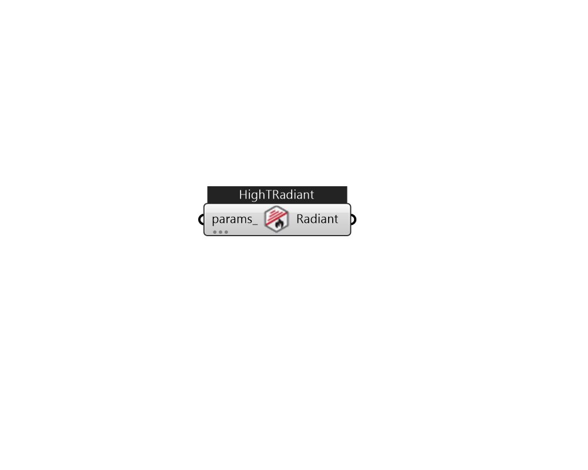

## IB_ZoneHVACHighTemperatureRadiant

The high temperature radiant system (gas-fired or electric) is a component of zone equipment that is intended to model any ``high temperature'' or ``high intensity'' radiant system where electric resistance or gas-fired combustion heating is used to supply energy (heat) to a building occupants directly as well as the building surfaces (wall, ceiling, or floor). The component is controlled by the radiant system controls defined in the syntax below and this control does not require the use of a zone thermostat unless the unit is being autosized. Note also that because this unit does not require a thermostat that in cases where no other systems are serving the zone in which this system resides that it will use the heating equipment priority to determine which system will run first. If the radiant system is serving a zone with forced air equipment, the radiant system will follow the priority order established by the zone thermostat but will still base its response on the controls defined b.... (Due to the length of content, documentation has been shown partially)  Above content copyright © 1996-2025 EnergyPlus, all contributors. All rights reserved. EnergyPlus is a trademark of the US Department of Energy. 

#### Inputs
* ##### params 
Detail settings for this HVAC object. Use Ironbug_ObjParams to set input parameters, or use Ironbug_OutputParams to set output variables. 

#### Outputs
* ##### Radiant
Connect to zone's equipment 