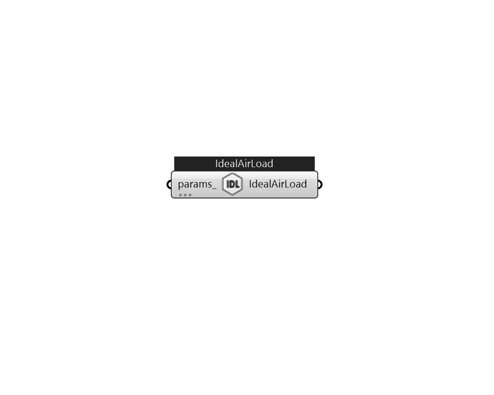

## IB_ZoneHVACIdealLoadsAirSystem

The simplest piece of zone equipment is the ZoneHVAC:IdealLoadsAirSystem component. ZoneHVAC:IdealLoadsAirSystem is used in situations where the user wishes to study the performance of a building without modeling a full HVAC system. In such a case, the Ideal Loads Air System is usually the sole conditioning component: the user does not need to specify air loops, water loops, etc. All that is needed for the ideal system are zone controls, zone equipment configurations, and the ideal loads system component. The use of a return plenum is optional and will require use of the AirloopHVAC:ReturnPlenum object. This component can be operated with infinite or finite heating and cooling capacity. For either mode—infinite or limited capacity—the user can also specify on/off schedules for heating and cooling and outdoor air controls. There are also optional controls for dehumidification, humidification, economizer, and heat recovery. This component may be used in combination with other HVAC equip.... (Due to the length of content, documentation has been shown partially)  Above content copyright © 1996-2025 EnergyPlus, all contributors. All rights reserved. EnergyPlus is a trademark of the US Department of Energy. 

#### Inputs
* ##### params 
Detail settings for this HVAC object. Use Ironbug_ObjParams to set input parameters, or use Ironbug_OutputParams to set output variables. 

#### Outputs
* ##### IdealAirLoad
Connect to zone's equipment 