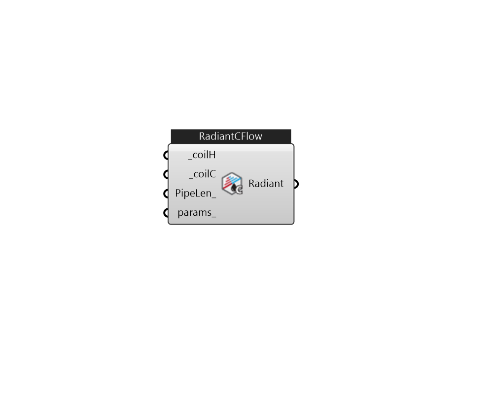

## IB_ZoneHVACLowTempRadiantConstFlow

This low temperature radiant system (hydronic) is a component of zone equipment that is intended to model any ``radiant system'' where water is used to supply/remove energy to/from a building surface (wall, ceiling, or floor). The component is controlled via control schedules as described in the syntax below and does not require a zone thermostat. Note that because this unit does not require a thermostat that in cases where no other systems are serving the zone in which this system resides that it will use the heating equipment priority to determine which system will run first. If the radiant system is serving a zone with forced air equipment, the radiant system will follow the priority order established by the zone thermostat but will still base its response on the controls defined by the user for the radiant system. The constant flow system differs from the variable flow system describe above in what it controls. The variable flow system varies the flow rate through the radiant syst.... (Due to the length of content, documentation has been shown partially)  Above content copyright © 1996-2025 EnergyPlus, all contributors. All rights reserved. EnergyPlus is a trademark of the US Department of Energy. 

#### Inputs
* ##### coilH [Required]
Heating coil to provide heating source. Must be CoilHeatingLowTempRadiantConstFlow. 
* ##### coilC [Required]
Cooling coil to provide cooling source. Must be CoilCoolingLowTempRadiantConstFlow. 
* ##### PipeLen 
PipeLength 
* ##### params 
Detail settings for this HVAC object. Use Ironbug_ObjParams to set input parameters, or use Ironbug_OutputParams to set output variables. 

#### Outputs
* ##### Radiant
Connect to zone's equipment 