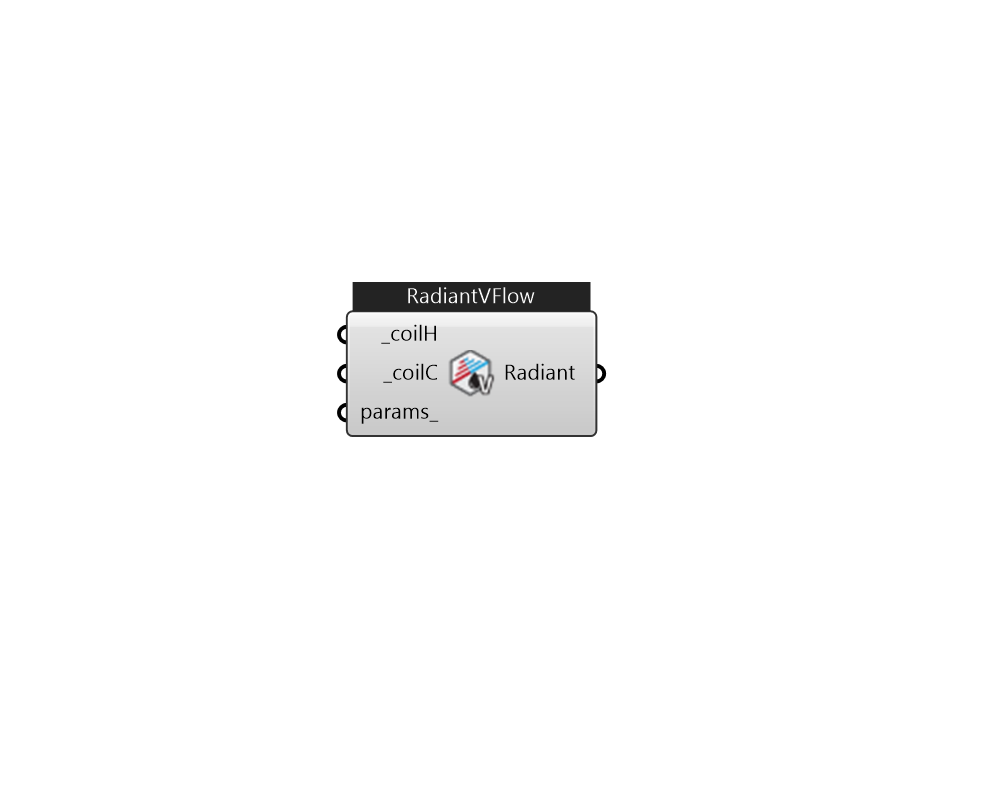

## IB_ZoneHVACLowTempRadiantVarFlow

This low temperature radiant system (hydronic) is a component of zone equipment that is intended to model any ``radiant system'' where water is used to supply/remove energy to/from a building surface (wall, ceiling, or floor). The component is controlled to meet any remaining zone load not met by other equipment in the zone that have higher priority. The control is accomplished by throttling the hot or chilled water flow to the unit. Note that this system will only control based on the radiant system controls defined by this input syntax and not via a zone thermostat such as is used for forced air systems. Note also that because this unit does not require a thermostat that in cases where no other systems are serving the zone in which this system resides that it will use the heating equipment priority to determine which system will run first. If the radiant system is serving a zone with forced air equipment, the radiant system will follow the priority order established by the zone therm.... (Due to the length of content, documentation has been shown partially)  Above content copyright © 1996-2025 EnergyPlus, all contributors. All rights reserved. EnergyPlus is a trademark of the US Department of Energy. 

#### Inputs
* ##### coilH [Required]
Heating coil to provide heating source. Must be CoilHeatingLowTempRadiantVarFlow. 
* ##### coilC [Required]
Cooling coil to provide cooling source. Must be CoilCoolingLowTempRadiantVarFlow. 
* ##### params 
Detail settings for this HVAC object. Use Ironbug_ObjParams to set input parameters, or use Ironbug_OutputParams to set output variables. 

#### Outputs
* ##### Radiant
Connect to zone's equipment 