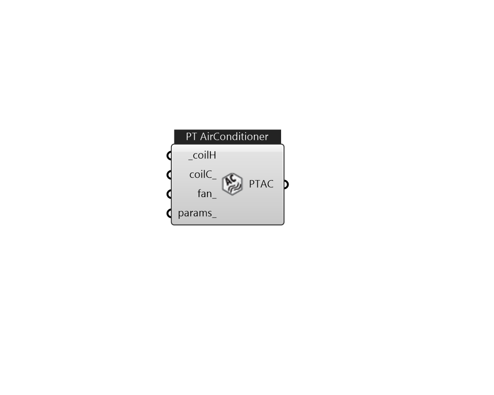

## IB_ZoneHVACPackagedTerminalAirConditioner

The packaged terminal air conditioner (PTAC) is a compound object made up of other components. Each PTAC consists of an outdoor air mixer, direct expansion (DX) cooling coil, heating coil (gas, electric, hot water, or steam) and a supply air fan. While the figure below shows the PTAC with draw through fan placement, blow through fan placement can also be modeled by positioning the supply air fan between the outdoor air mixer and the DX cooling coil. The packaged terminal air conditioner coordinates the operation of these components and is modeled as a type of zone equipment (Ref. {ZoneHVAC:EquipmentList} and {ZoneHVAC:EquipmentConnections}). Links to the PTAC's supply air fan, DX cooling coil, heating coil, and outdoor air mixer specifications are provided in the air conditioner's input syntax. Additional inputs include supply and outdoor air flow rates during cooling operation, heating operation, and when neither cooling or heating is required. A description of each input field for t.... (Due to the length of content, documentation has been shown partially)  Above content copyright © 1996-2025 EnergyPlus, all contributors. All rights reserved. EnergyPlus is a trademark of the US Department of Energy. 

#### Inputs
* ##### coilH [Required]
Heating coil to provide heating source. Valid options: CoilHeatingElectric, CoilHeatingWater, or CoilHeatingGas 
* ##### coilC 
Cooling coil to provide cooling source. CoilCoolingDX 
* ##### fan 
Valid options: FanConstantVolume, FanVariableVolume, or FanOnOff. 
* ##### params 
Detail settings for this HVAC object. Use Ironbug_ObjParams to set input parameters, or use Ironbug_OutputParams to set output variables. 

#### Outputs
* ##### PTAC
Connect to zone's equipment 