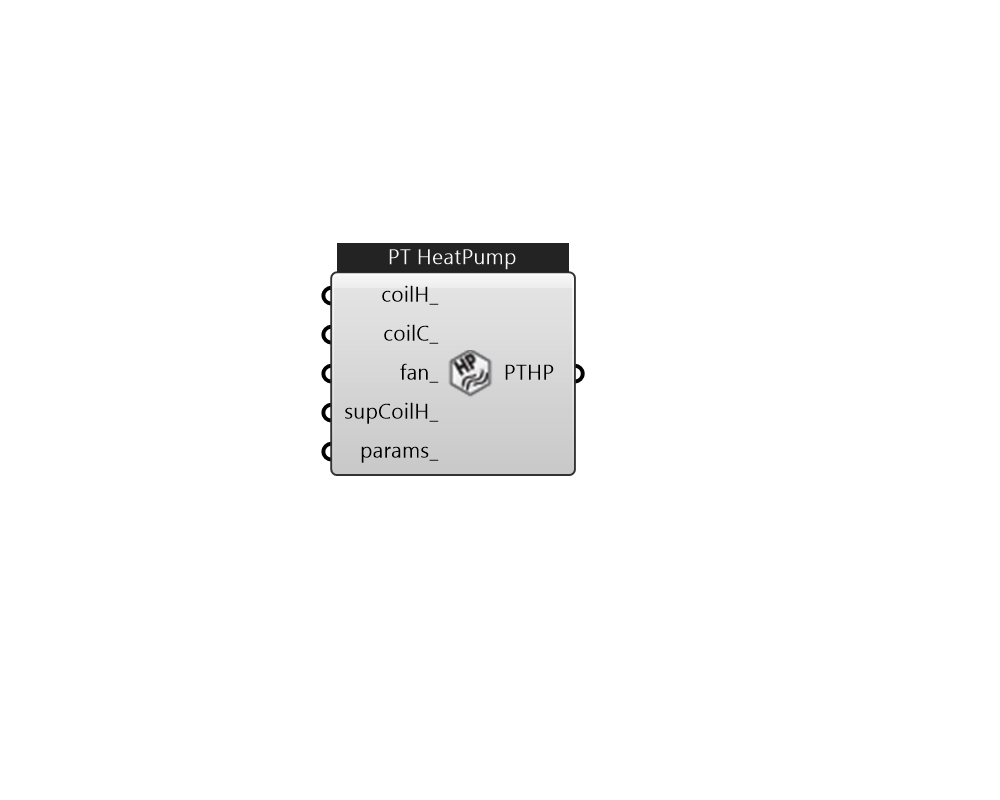

## IB_ZoneHVACPackagedTerminalHeatPump

The packaged terminal heat pump (PTHP) is a compound object made up of other components. Each PTHP consists of an outdoor air mixer, direct expansion (DX) cooling coil, DX heating coil, supply air fan, and a supplemental heating coil as shown in the figure below. These individual components are described elsewhere in this document. The packaged terminal heat pump coordinates the operation of these components and is modeled as a type of zone equipment (Ref. {ZoneHVAC:EquipmentList} and {ZoneHVAC:EquipmentConnections}). Links to the PTHP's supply air fan, DX coils, supplemental heating coil, and outdoor air mixer specifications are provided in the heat pump's input syntax. Additional inputs include supply and outdoor air flow rates during cooling operation, heating operation, and when neither cooling or heating is required. A description of each input field for the packaged terminal heat pump compound object is provided below.  Above content copyright © 1996-2025 EnergyPlus, all contributors. All rights reserved. EnergyPlus is a trademark of the US Department of Energy. 

#### Inputs
* ##### coilH 
Heating coil to provide heating source. CoilHeatingDX 
* ##### coilC 
Cooling coil to provide cooling source. CoilCoolingDX 
* ##### fan 
FanConstantVolume, FanVariableVolume, or FanOnOff 
* ##### supCoilH 
Supplemental heating coil: CoilHeatingElectric 
* ##### params 
Detail settings for this HVAC object. Use Ironbug_ObjParams to set input parameters, or use Ironbug_OutputParams to set output variables. 

#### Outputs
* ##### PTHP
Connect to zone's equipment 