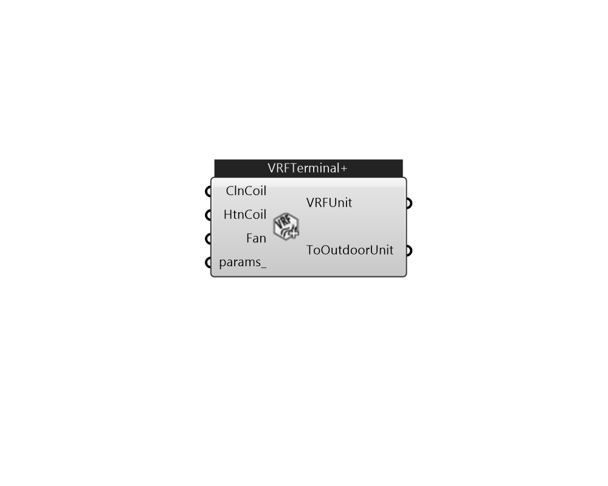

## IB_ZoneHVACTerminalUnitVariableRefrigerantFlow+

Use this component to set customized cooling coil, heating coil, or fan for VRF terminal unit. 

#### Inputs
* ##### ClnCoil 
Optional input, but use CoilCoolingDXVariableRefrigerantFlow only 
* ##### HtnCoil 
Optional input, but use CoilHeatingDXVariableRefrigerantFlow only 
* ##### Fan 
Optional input, but use FanOnOff only 
* ##### params 
Detail settings for this HVAC object. Use Ironbug_ObjParams to set input parameters, or use Ironbug_OutputParams to set output variables. 

#### Outputs
* ##### VRFUnit
Connect to Zone's equipment or airloop supply side 
* ##### ToOutdoorUnit
Connect to VRF system 