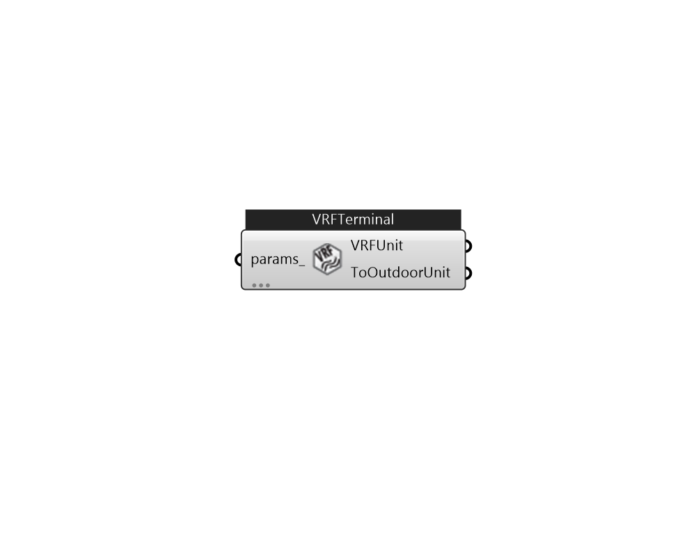

## IB_ZoneHVACTerminalUnitVariableRefrigerantFlow

Terminal units with variable refrigerant flow compound HVAC object are used exclusively with variable refrigerant flow (VRF) air conditioning systems (Ref. {AirConditioner:VariableRefrigerantFlow} objects). The VRF terminal unit may be used as zone, air loop or outside air system equipment. The VRF terminal unit compound object contains an optional outdoor air mixer, a DX cooling coil, a DX heating coil, a supply fan (optional for air loop and outdoor air system equipment), and an optional supplemental heating coil object. When the inputs of the last two fields (Design Specification Multispeed Object Type and Design Specification Multispeed Fan Object Name) are entered, a multiuspeed fan with different air flow rates is applied to Coil:Cooling:DX:VariableRefrigerantFlow and Coil:Heating:DX:VariableRefrigerantFlow.  The fan speed number is determined by zone load. The fan air flow cycles between adjacent speeds based on the cooling / heating capacity (or coordinate with the cooling / h.... (Due to the length of content, documentation has been shown partially)  Above content copyright © 1996-2025 EnergyPlus, all contributors. All rights reserved. EnergyPlus is a trademark of the US Department of Energy. 

#### Inputs
* ##### params 
Detail settings for this HVAC object. Use Ironbug_ObjParams to set input parameters, or use Ironbug_OutputParams to set output variables. 

#### Outputs
* ##### VRFUnit
Connect to Zone's equipment 
* ##### ToOutdoorUnit
Connect to VRF system 