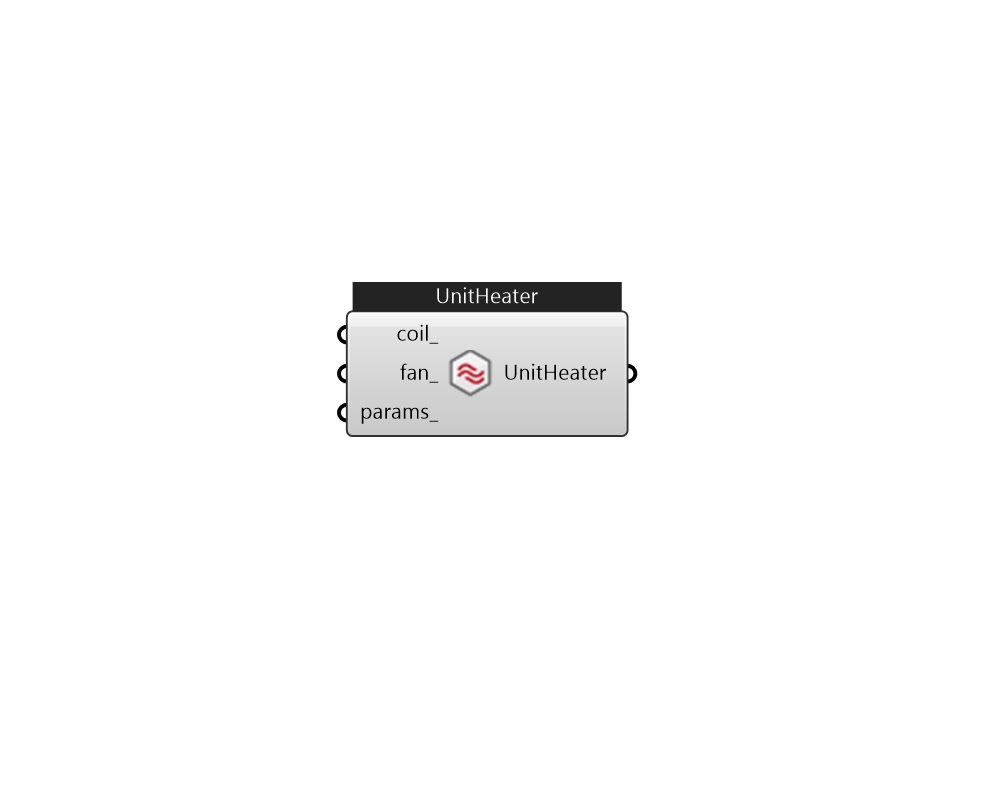

## IB_ZoneHVACUnitHeater

Unit heaters are zone equipment units which are assembled from other components and are a simplification of unit ventilators. They contain only a fan and a heating coil. These components are described elsewhere in this document. The unit heater input simply requires the names of these components, which have to be described elsewhere in the input. The input also requires the name of an availability schedule, maximum airflow rate, and maximum and minimum hot water volumetric flow rates. The unit is connected to the zone inlet and exhaust nodes by specifying unit inlet and outlet node names. Note that the unit air inlet node should be the same as a zone exhaust node and the unit outlet node should be the same as a zone inlet node. While the control of the heating coil is similar to the fan coil units and the unit ventilator, the overall control of the unit heater is much different. There are four different modes in which a unit heat can operate based on the user input: {Off:} Unit is sc.... (Due to the length of content, documentation has been shown partially)  Above content copyright © 1996-2025 EnergyPlus, all contributors. All rights reserved. EnergyPlus is a trademark of the US Department of Energy. 

#### Inputs
* ##### coil 
Heating coil to provide reheat source. can be CoilHeatingWater, CoilHeatingElectirc, or CoilHeatingGas. 
* ##### fan 
Can be FanConstantVolume or FanVariableVolume. 
* ##### params 
Detail settings for this HVAC object. Use Ironbug_ObjParams to set input parameters, or use Ironbug_OutputParams to set output variables. 

#### Outputs
* ##### UnitHeater
Connect to zone's equipment 