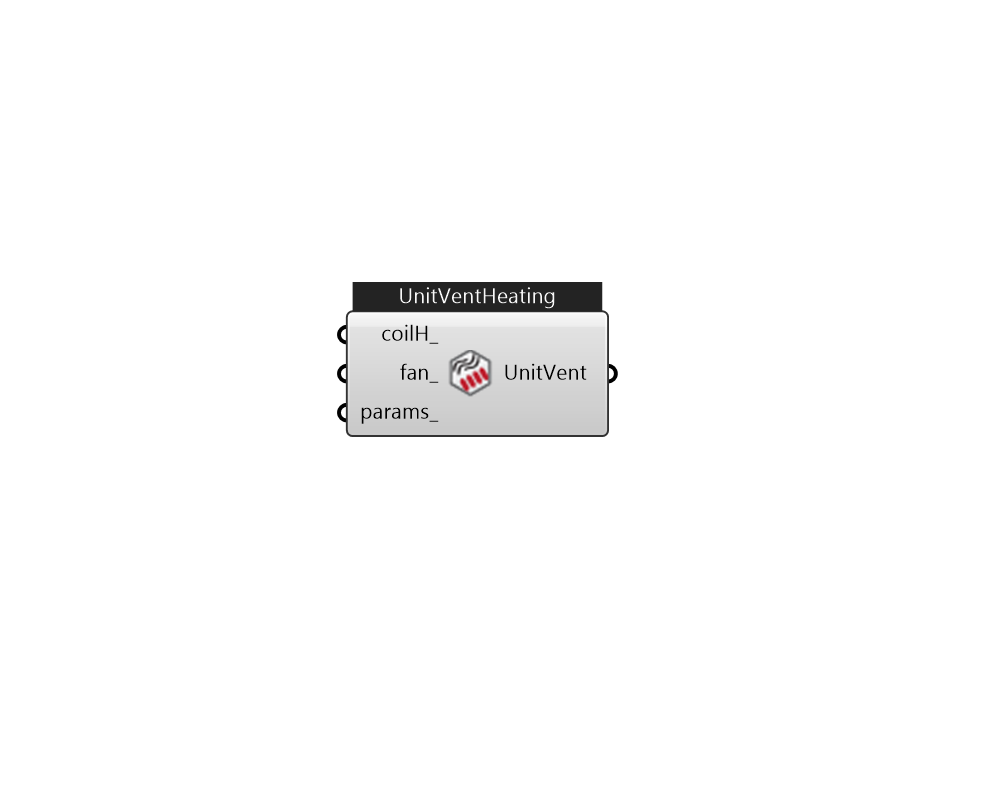

## IB_ZoneHVACUnitVentilator_Heating

Unit ventilators are zone equipment units which are assembled from other components. They contain a built-in outdoor air mixer, a fan, a heating coil, and a cooling coil. These components are described elsewhere in this document, except the built-in outdoor air mixer which is contained within the unit ventilator statement. The unit ventilator input simply requires the names of these other three components, which have to be described elsewhere in the input. The input also requires the name of an availability schedule, maximum airflow rate, outdoor air control information (control type and schedules) and an outdoor airflow rate. The unit is connected to the zone inlet and exhaust nodes and the outdoor air by specifying unit inlet, outlet, outdoor air, mixed air and exhaust (relief) air node names. Note that if the Unit Ventilator is not connected to central dedicated outdoor air (DOA), then the unit air inlet node should be the same as a zone exhaust air node and the unit air outlet node.... (Due to the length of content, documentation has been shown partially)  Above content copyright © 1996-2025 EnergyPlus, all contributors. All rights reserved. EnergyPlus is a trademark of the US Department of Energy. 

#### Inputs
* ##### coilH 
Heating coil to provide reheat source. can be CoilHeatingWater, CoilHeatingElectirc, or CoilHeatingGas. 
* ##### fan 
Can be FanConstantVolume or FanVariableVolume. 
* ##### params 
Detail settings for this HVAC object. Use Ironbug_ObjParams to set input parameters, or use Ironbug_OutputParams to set output variables. 

#### Outputs
* ##### UnitVent
Connect to zone's equipment 