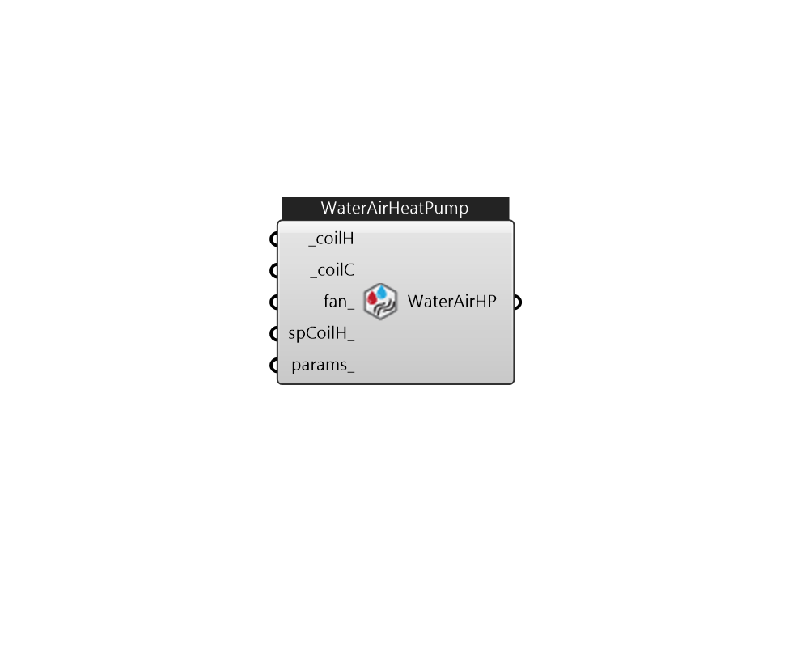

## IB_ZoneHVACWaterToAirHeatPump

The zone water-to-air heat pump is a compound component consisting of a fan, water-to-air cooling and heating coils, and a supplemental heating coil. Links to the fan, WaterToAirHeatPump cooling coil, WaterToAirHeatPump heating coil, and supplementary heating coil specifications are provided in the heat pump's input data syntax. The heat pump switches between cooling and heating depending on the zone's demand. The load side (air) of the zone water-to-air heat pump consists of an On/Off fan component, a WaterToAirHeatPump cooling coil component, a WaterToAirHeatPump heating coil component, and a Gas or Electric supplemental heating coil component. The source side (water) of the heat pump is connected to a condenser loop with a heat exchanger (ground heat exchanger or other type) or a plant loop with a heating source such as a boiler and a cooling source such as a chiller or cooling tower. The diagram below shows the setup and connection of the heat pump for the source side and load side.... (Due to the length of content, documentation has been shown partially)  Above content copyright © 1996-2025 EnergyPlus, all contributors. All rights reserved. EnergyPlus is a trademark of the US Department of Energy. 

#### Inputs
* ##### coilH [Required]
Heating coil to provide heating source. use CoilHeatingWaterToAirHeatPump 
* ##### coilC [Required]
Cooling coil to provide cooling source. use CoilCoolingWaterToAirHeatPump 
* ##### fan 
Can be FanOnOff 
* ##### spCoilH 
Backup HeatingCoil. CoilHeatingElectric, CoilHeatingGas, or CoilHeatingWater 
* ##### params 
Detail settings for this HVAC object. Use Ironbug_ObjParams to set input parameters, or use Ironbug_OutputParams to set output variables. 

#### Outputs
* ##### WaterAirHP
Connect to zone's equipment 